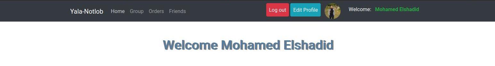

# README

This README would normally document whatever steps are necessary to get the
application up and running.

Things you may want to cover:

- Ruby version

- System dependencies

- Configuration

- Database creation

- Database initialization

- How to run the test suite

- Services (job queues, cache servers, search engines, etc.)

- Deployment instructions

- ...

1-Authentication

<pre>
- The user can Register using facebook or google account
- The User can Upload Profile Image
- The user can Login using facebook or google account
- Users can't redirect to any page without login
- User can see his name and profile image in navbar
</pre>

### -Project Images

